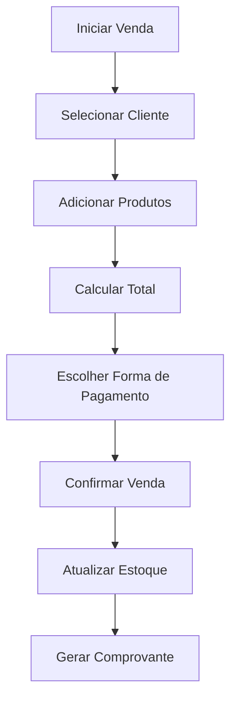
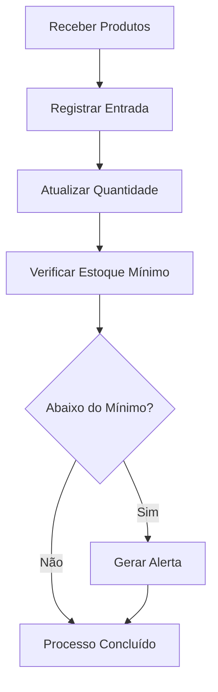
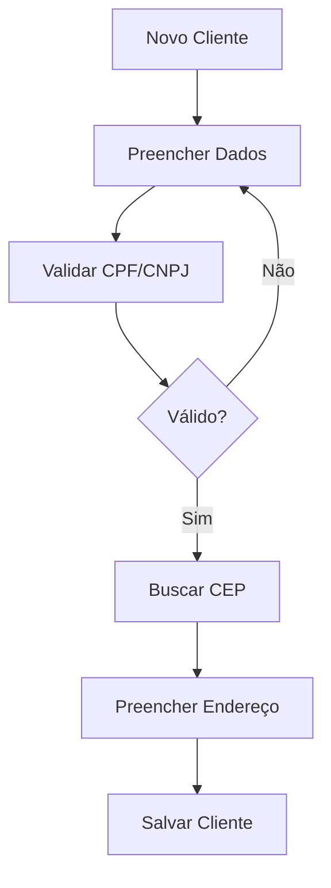

# 📚 Documentação de Funcionalidades - Sistema BVOLT

## 🎯 Visão Geral

Este diretório contém a documentação completa de todas as funcionalidades do sistema BVOLT, voltada para usuários finais, administradores e equipe de suporte.

## 📂 Estrutura da Documentação

### 🔐 Autenticação e Segurança
- **[Autenticação](./autenticacao.md)** - Sistema de login, logout e gerenciamento de sessão
- **[Gerenciamento de Usuários](./gerenciamento-usuarios.md)** - Cadastro, edição e permissões de usuários

### 📊 Dashboard e Visão Geral
- **[Dashboard Principal](./dashboard.md)** - Painel de controle com métricas e visão geral do negócio

### 🛍️ Gestão Comercial
- **[Gestão de Produtos](./gestao-produtos.md)** - Cadastro, edição e organização de produtos
- **[Gestão de Categorias](./gestao-categorias.md)** - Organização e classificação de produtos
- **[Gestão de Vendas](./gestao-vendas.md)** - Processo completo de vendas e faturamento

### 👥 Relacionamento
- **[Gestão de Clientes](./gestao-clientes.md)** - Cadastro e acompanhamento de clientes
- **[Gestão de Fornecedores](./gestao-fornecedores.md)** - Gerenciamento de fornecedores e parceiros

### 📦 Operações
- **[Controle de Estoque](./controle-estoque.md)** - Gerenciamento de inventário e movimentações
- **[Configurações](./configuracoes.md)** - Personalização do sistema

### 📈 Relatórios e Análises
- **[Sistema de Relatórios](./relatorios.md)** - Geração de relatórios e análises de negócio

## 🎯 Níveis de Acesso

### 👨‍💼 Administrador (Admin)
- **Acesso Total**: Todas as funcionalidades do sistema
- **Usuários**: Pode criar, editar e remover usuários
- **Configurações**: Acesso completo às configurações do sistema
- **Relatórios**: Todos os relatórios disponíveis
- **Dados**: Pode visualizar e modificar todos os dados

### 👨‍💻 Gerente
- **Gestão Comercial**: Produtos, vendas, clientes e fornecedores
- **Relatórios**: Relatórios operacionais e gerenciais
- **Estoque**: Controle completo de estoque
- **Usuários**: Pode gerenciar vendedores (criar/editar, não remover)
- **Limitações**: Não pode alterar configurações críticas do sistema

### 👨‍💼 Vendedor
- **Vendas**: Pode realizar vendas e consultar histórico próprio
- **Clientes**: Pode cadastrar e editar clientes
- **Produtos**: Pode consultar produtos e verificar estoque
- **Relatórios**: Apenas relatórios de suas próprias vendas
- **Limitações**: Não pode acessar configurações ou dados de outros vendedores

## 🔄 Fluxos Principais

### 🛒 Fluxo de Venda

### 📦 Fluxo de Estoque

### 👤 Fluxo de Cliente

## 🎨 Interface do Usuário

### 📱 Design Responsivo
- **Desktop**: Layout completo com sidebar e múltiplas colunas
- **Tablet**: Layout adaptado com menu retrátil
- **Mobile**: Interface otimizada para toque com navegação simplificada

### 🎨 Temas
- **Modo Claro**: Interface padrão com fundo branco
- **Modo Escuro**: Interface com fundo escuro para reduzir fadiga visual

### ♿ Acessibilidade
- **Contraste**: Cores com contraste adequado para leitura
- **Navegação**: Suporte completo para navegação por teclado
- **Screen Readers**: Compatibilidade com leitores de tela
- **Tamanhos**: Textos e botões com tamanhos adequados

## 🔔 Notificações e Alertas

### 📢 Tipos de Notificação
- **Sucesso**: Operações concluídas com êxito
- **Aviso**: Situações que requerem atenção
- **Erro**: Problemas que impedem operações
- **Informação**: Dicas e informações úteis

### 🚨 Alertas Automáticos
- **Estoque Baixo**: Produtos abaixo do estoque mínimo
- **Vendas Importantes**: Vendas de alto valor
- **Novos Clientes**: Primeiro cadastro de cliente
- **Metas**: Acompanhamento de metas de vendas

## 📱 Compatibilidade

### 🌐 Navegadores Suportados
- **Chrome**: Versão 80+
- **Firefox**: Versão 75+
- **Safari**: Versão 13+
- **Edge**: Versão 80+

### 📱 Dispositivos
- **Desktop**: Windows, macOS, Linux
- **Tablet**: iPad, Android tablets
- **Mobile**: iOS 13+, Android 8+

## 🔧 Configurações Padrão

### ⚙️ Sistema
- **Idioma**: Português (Brasil)
- **Moeda**: Real (R$)
- **Timezone**: America/Sao_Paulo
- **Formato de Data**: dd/mm/yyyy
- **Separador Decimal**: Vírgula (,)

### 🏪 Loja
- **Regime Tributário**: Simples Nacional (padrão)
- **Estoque Mínimo**: 10 unidades (padrão)
- **Formas de Pagamento**: Dinheiro, Cartão, PIX
- **Validade de Sessão**: 24 horas

## 📞 Suporte e Ajuda

### 🆘 Recursos de Ajuda
- **Tooltips**: Dicas contextuais em campos e botões
- **Guias Rápidos**: Tutoriais passo a passo para funções principais
- **FAQ**: Perguntas frequentes integradas ao sistema
- **Atalhos**: Lista de atalhos de teclado disponíveis

### 📧 Contato
- **Email**: suporte@bvolt.com
- **Telefone**: (11) 99999-9999
- **Chat**: Suporte online durante horário comercial
- **Documentação**: Portal de conhecimento online

## 🔄 Atualizações

### 📅 Cronograma
- **Atualizações de Segurança**: Conforme necessário
- **Correções**: Mensalmente
- **Novas Funcionalidades**: Trimestralmente
- **Atualizações Principais**: Semestralmente

### 📋 Changelog
Todas as alterações são documentadas e comunicadas aos usuários através de:
- Notificações no sistema
- Email para administradores
- Portal de atualizações
- Notas de versão detalhadas